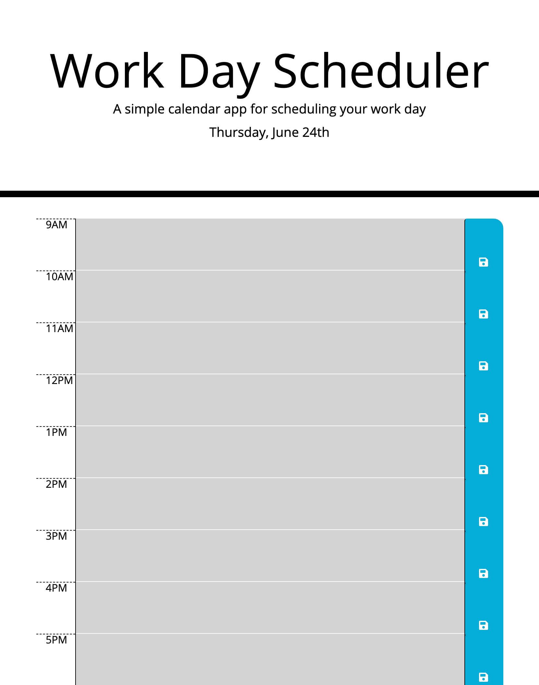

# Workday-Scheduler

## Description
- For this task, I wanted to practice using jQuery and moment to create an effective daily planner. This scheduler displays the hours in a work day and allows users to manage their time. 
- I built this quiz to gain a better understanding of the use of jQuery and compare it to vanilla JavaScript. I've come to understand how useful jQuery is when developing a website. I also go to play with moment.js, this cdn is very useful when it comes to making a daily planner.
- This task helped me gain addition experience and practice with jQuery. I am now better equiped to navigate the ways in which I cna implement jQuery into my development. 
- This weekly planner helped me realize how much easier it is to use jQuery when compared to using vanilla JavaScript. The example of setting items in local storage and getting items from local storage is night and day when developing.

## Webpage

## Link
https://vivicowan.github.io/workday-scheduler/
